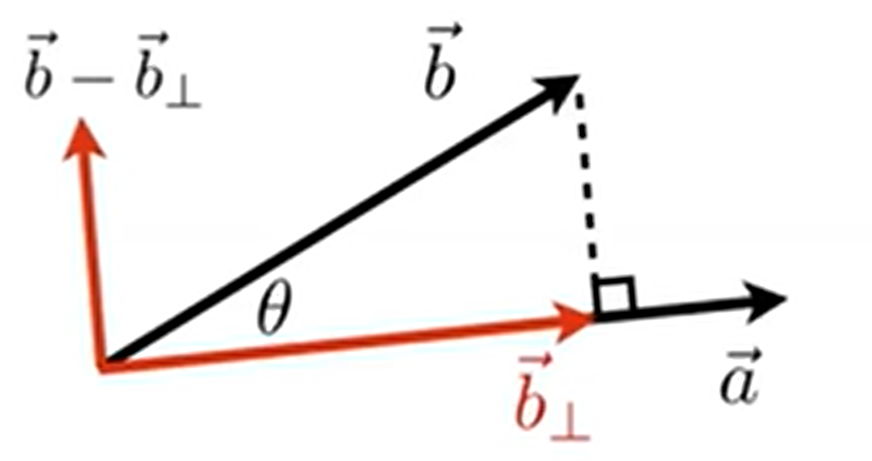
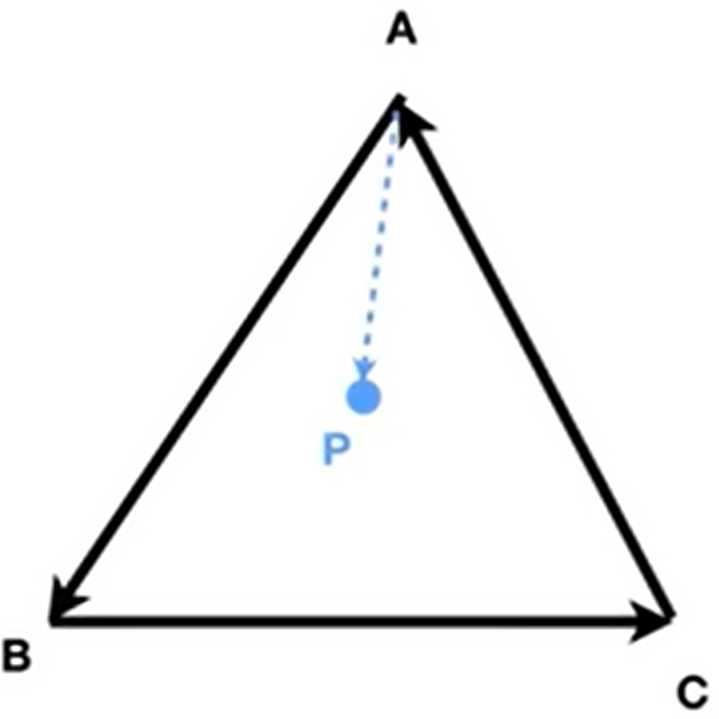
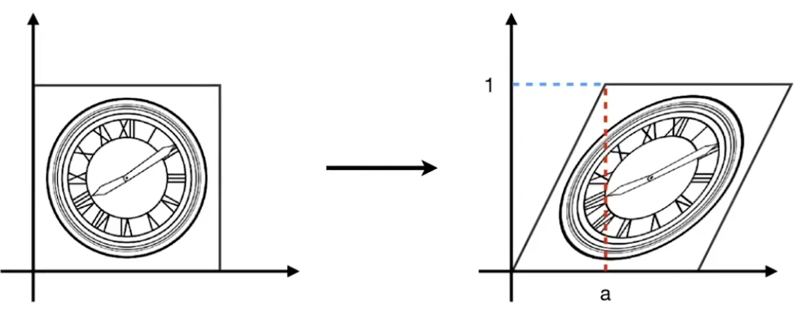
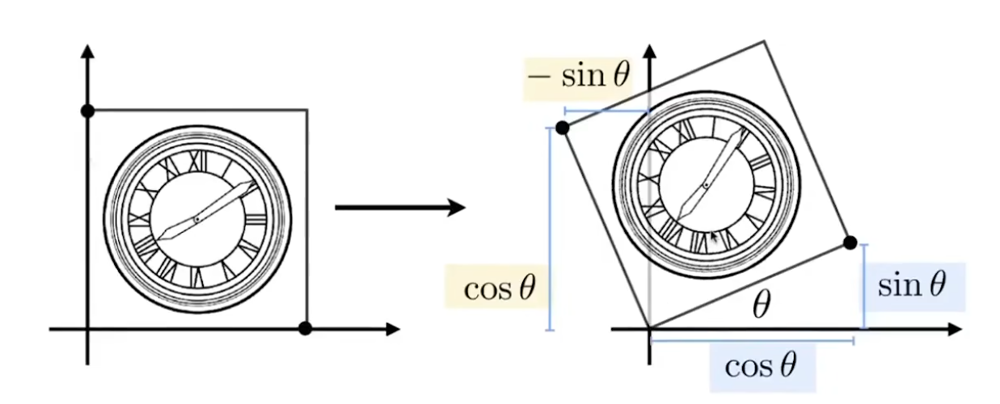
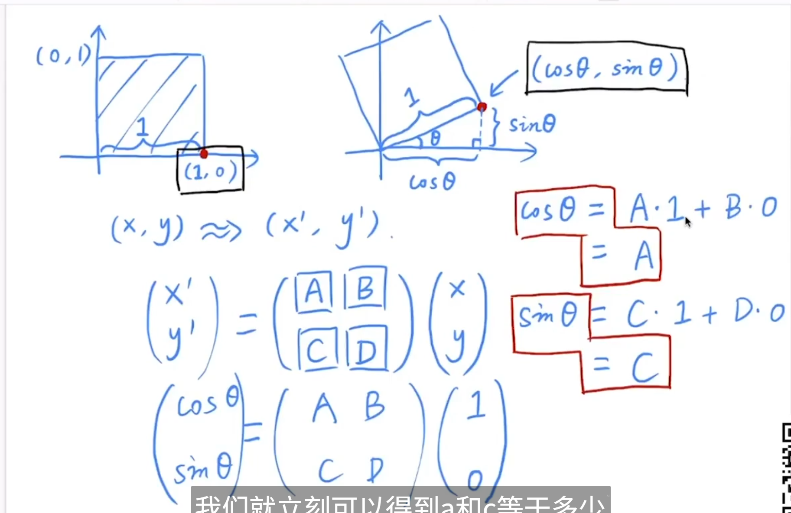
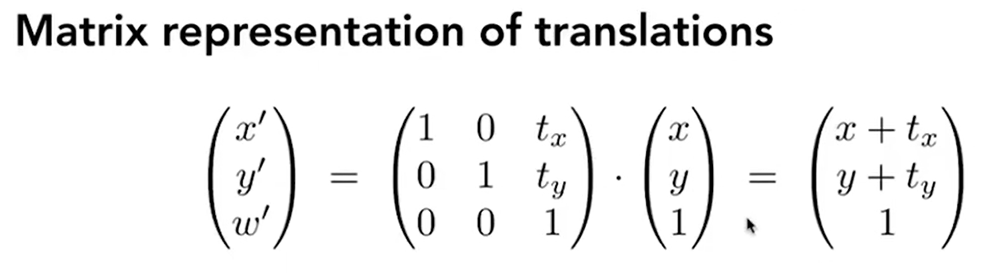
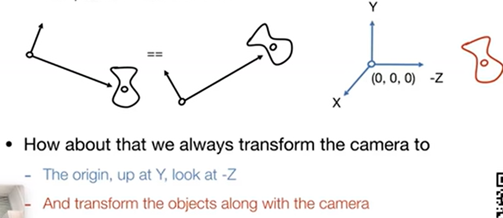
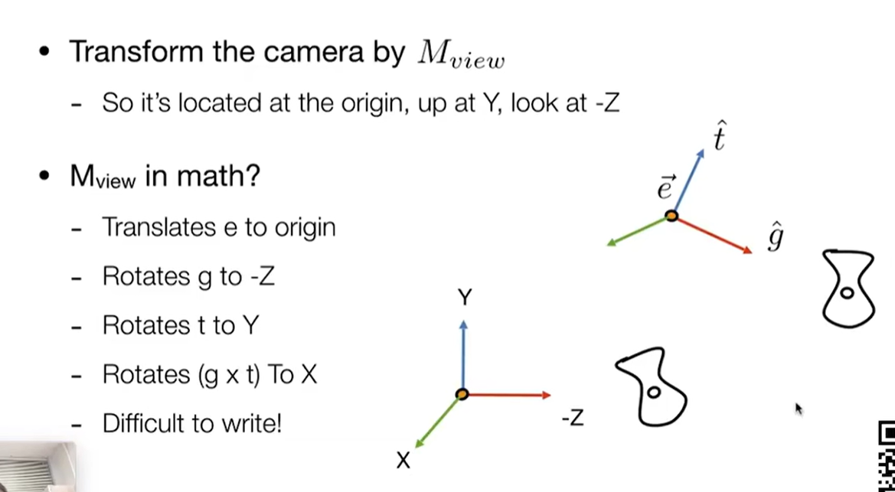

#### 一、线性代数回顾

##### 1.向量定义

- 大小方向
- 没有固定的起点，只代表起点与终点之间的相对位置关系。

 模长$||\vec{a}||$

单位向量$\hat{a}=\frac{\vec{a}}{||\vec{a}||}$

加法：

- 在几何上，三角形法则：**将被加向量尾与加向量头部相连**
- 在代数上，直接加上坐标

**默认所有向量都是列向量。**

##### 2.向量运算

###### 1.点乘：

- 几何上$\vec{a}\cdot\vec{b}=||\vec{a}||||\vec{b}||\cos{\theta}$。对于单位向量，模长为1，所以点乘值即其夹角的余弦。**点乘结果是数，已知向量的代数表示即可立刻得到其夹角。**
- 满足交换、结合、分配律
- 代数上，$\vec{a}\cdot\vec{b}=\pmatrix{x_a\\x_b}\cdot\pmatrix{y_a\\y_b}$。以此类推，高维向量点乘也是对应相乘再相加。

- 投影：将向量b投影到a上，得到一个新的向量：

- 即：$\vec{b}_{\perp}=\vec{b}\cos{\theta}$
  - $\vec{b}_{\perp}$是与a共线的向量，所以必然有$\vec{b}_{\perp}=k\hat{a}$（单位向量）
  - 对上式子两边取模长，k就是$\vec{b}_{\perp}$的模长。而根据三角关系，$||\vec{b}_{\perp}||=||\vec{b}||\cos{\theta}$
    - 共线、求出了长度关系，则可以去掉模长符号。
- 好处：
  - 可以将一个向量分解为两个互相垂直的向量：例如上图中可以分解得到$\vec{b}_{\perp}、\vec{b}-\vec{b}_{\perp}$两个向量。
  - 可以通过计算点乘得到两个向量的相近程度。（Transformer的核心）。如果点乘结果小于0说明它们之间大于90度；大于0就小于90度。

###### 2.叉乘

- 算法：**右手定则**，四指指向左乘向量的方向，此时如果四指往掌心并拢的方向能够转向右乘向量的方向，则大拇指即结果的方向。

- 规则：

  - $\vec{a} \times\vec{b} = -\vec{b}\times\vec{a}$
  - $||\vec{a} \times\vec{b}|| = ||\vec{a}||||\vec{b}||\sin{\theta}$
  - 满足分配律，交换要加负号；不满足结合律。
  - 自己与自己叉乘得到垂直的0**向量**，

- 用处：

  - 三维空间里面确定坐标系。已知x和y轴将其叉乘即得到z轴。**按照上述情况得到的z轴组成的坐标系就叫做右手坐标系，课程默认都是右手坐标系。**(高数课的坐标系就是这样画的)

  - 判断一个向量与另一个向量的相对位置（在左还是在右）。如果叉乘结果是正的（右手拇指向上），则说明被考查向量在基准向量的左边（基准向量逆时针旋转后到达被考察向量）；反之在右边（顺时针）。

  - **判断一个点是否在一个封闭图形内部**：

    

​	将图形用向量按同一方向包围，依次作顶点与待求点的向量，再用边组成的向量分别与作出的向量求叉乘。如果所有边的叉乘结果都同号，则说明这个点在图形内部，否则至少有一个反号就在外面。直观地说，就是P点一直在三条边的左边/右边。

​	如果叉乘得到了0？边界情况，由用户自己决定。

##### 3.坐标系的定义：

任意三个向量如果满足：

$\begin{cases}||\vec{u}||=||\vec{v}||=||\vec{w}||=1 \\ \vec{u}\cdot\vec{v}=\vec{u}\cdot\vec{w}=\vec{v}\cdot\vec{w}=0 \\ \vec{w}=\vec{u}\times\vec{v}\end{cases}$

则可以构成一个坐标系，坐标系中任意向量$\vec{p}=(\vec{p}\cdot{\vec{u}})\vec{u}+(\vec{p}\cdot{\vec{v}})\vec{v}+(\vec{p}\cdot{\vec{w}})\vec{w}$.

其中$(\vec{p}\cdot{\vec{u}})\vec{u}$的系数就是p在u上的投影，但是u是单位向量，所以实质就是p在u上的长度，再乘以单位向量u化为向量。这样就把p分解为向量之和。

##### 3.矩阵

###### 1.矩阵乘法

$A_{m\times n}B_{n\times l}=C_{m\times l}$；

C矩阵**第i行第j列的元素**，**即A矩阵第i行的行向量**与**B矩阵第j行的列向量**==点乘==的结果。

性质

- 满足结合律、分配律
- **不满足交换律**

###### 2.转置、逆矩阵、单位矩阵

还记得吧？

- $(AB)^T=B^TA^T$
- $(AB)^{-1}=B^{-1}A^{-1}$
- $AA^{-1}=E$或者写成$AA^{-1}=I$

其他应用：

- $\vec{a}\cdot\vec{b}=\vec{a}^T\vec{b}$（右边是矩阵相乘）
- $\vec{a}\cdot\vec{b}=A^*\vec{b}=\pmatrix{0&-a_3&a_2\\a_3&0&-a_1\\-a_2&a_1&0}\pmatrix{b_1\\b_2\\b_3}$。这个A称作a向量的对偶矩阵。

#### 二、变换

##### 1.二维变换

求解变换矩阵的核心是找到旋转后坐标与之前坐标的等式关系。**由于每一个点都应该满足这样一个等式，所以只要求得一个点的等式关系，并且这个等式不含有以x y x' y'以及已知图形参数和变换距离和角度之外的数，则这个点的等式关系也就是整个图的等式关系。**这样可以用某些特殊点去求得整个图的变化。

变换矩阵推导方法示例见第4.节旋转。

###### 1.缩放(scale)

- 均匀缩放：设原来图像中任一点坐标是(x,y)，则变换后可以记作x'=sx、y'=sy。写作矩阵形式也可以是：$\pmatrix{x'\\y'}=\pmatrix{s&0\\0&s}\pmatrix{x\\y}$.在这里右侧左乘的矩阵就叫做缩放矩阵。

- 不均匀缩放：同上，但是主对角线的s可以取不同值：$\pmatrix{x'\\y'}=\pmatrix{s_x&0\\0&s_y}\pmatrix{x\\y}$

###### 2.反射（reflection)

将图像关于某坐标轴对称。自然，关于x轴对称把y全部取反，即$s_x=1,s_y=-1$；关于y轴对称把x全部取反即可，即$s_x=-1,s_y=1$.

###### 3.切变（shear)

上图是一个边长为1的正方形，将其切变。

由于所有y=1处的点都移动了1，设所有x=0处的点移动**后**坐标变为$(t_x,t_y)$，那么由相似三角形就有$\frac{t_y}{1}=\frac{t_x}{a}$，得到$t_x=at_y$。

而这些点移动前x=0，所以水平方向就**移动了**tx-0=aty；竖直方向没有移动，移动前后y不变；又由于同一y上所有点的水平移动距离相同，所以那些x不等于0处的点也移动了aty（这个ty对于同一水平线上的点都相同，所以可以用x=0处点的ty来代入）。

则变换前后y'=y, x'=x+ay，写作矩阵即：$\pmatrix{x'\\y'}=\pmatrix{1&a\\0&1}\pmatrix{x\\y}$。注意$at_y$是移动的距离哦！

如果是沿着y方向做切变，那x=1保持不变，y往上移动a，于是变换矩阵变成下三角即可。

###### 4.旋转

默认情况下，只说旋转则是将图形绕着原点、逆时针旋转。

**其本质是绕着生成旋转轴的叉乘方向进行旋转。例如这里就是绕着x叉乘y所得的z轴、进行叉乘的方向（逆时针）旋转。**

上图仍然是一个边长为1的正方形，结果显然。如果边长为a，那么旋转后右下角顶点的坐标应该是$(a\cos\theta,a\sin\theta)$；左上角的sinθ由于本身仍正但是点在第二象限，所以取了负号。

上图展示了如何进行变换矩阵的推导。

- 由于变换矩阵的对于所有点的变换都适用，只需要用有限个特例即可求得变换矩阵的所有参数，并且它一定是正确的变换矩阵。

- 所以在这个例子里，可以设矩阵的四个数分别是ABCD，然后取两个点如(1,0)和(0,1)，找到变换前后的关系，代入这个方程组求解ABCD即可。

- 得到的结果为：$\bold R=\pmatrix{\cos\theta&-\sin\theta\\\sin\theta& \cos\theta}$

  如果要旋转-θ角度，则把-θ代入得到$\bold R'=\pmatrix{\cos\theta&\sin\theta\\-\sin\theta& \cos\theta}=\bold R^T=\bold R^{-1}$

  这说明这个结果矩阵**是正交矩阵**。它意味着旋转变换是正交变换。

**以上变换都是线性变换，这意味着：**

- 线性变换保持直线为直线。

- 平行线仍然平行。
- 原点保持不动。

- 图形可能被旋转、拉伸、反射或扭曲（切变），但不会弯曲。

平移引入了加法，会导致原点发生改变，不属于线性变换。那么有没有方法可以使得平移也变成线性变换？

##### 2.齐次坐标（Homogenous coordinate)

###### 1.定义

为了统一平移运算到线性变换中，**为二维点额外加上一个维度坐标，默认为1；为二维向量额外加上一个维度坐标，默认为0**。

即：$点=(x,y,1)^T;向量=(x,y,0)^T$.

此时对点进行平移即可写作：

**为什么向量的额外维度记0？**因为向量描述的是两个点之间的关系，就像音程一样，它具有平移不变性，将其平移不会改变其描述的关系。

###### 2.性质

这样的定义也能满足点和向量之间的运算法则：

- 向量+向量=向量（三角形法则），第3个维度0+0=0还是向量；
- 点-点=向量，第3个维度1-1=0变成向量；
- 点+向量=点（点沿着向量移动到了新的点），第3个维度是0+1=1；
- 点+点没有定义。**此处加上定义：**

齐次坐标中，$\pmatrix{x\\y\\w}且w\neq0，则它表示的点实际为(x/w\ \ \ y/w).$

由此，**点+点在齐次坐标中表示的是两个点的中点。**例如两个第3维都是1的点相加，前2维度加一起除以第3维度的2正是中点

##### 3.仿射变换Affine

如果一个变换可以表示为线性映射+平移的过程，则称为仿射变换。 

仿射变换在不使用齐次坐标的情况下即$\pmatrix{x'\\y'}=\pmatrix{a&b\\c&d}\pmatrix{x\\y}+\pmatrix{t_x\\t_y}$

使用齐次坐标即：

$\pmatrix{x'\\y'\\1}=\pmatrix{a&b&t_x\\c&d&t_y\\0&0&1}\pmatrix{x\\y\\1}$

其中，表示**二维仿射变换的变换矩阵**的第三行一定是0 0 1；表示线性变换的部分是左上角分块矩阵；表示平移变换的部分是第3列。

- **这个矩阵表示的是先进行线性变换，再平移。**例如先旋转再平移，就是T·R（右边的矩阵先作用）
- 如果没有平移变换，则tx=ty=0。
- **根据矩阵乘法，变换矩阵的每一个行向量分别决定x'、y'、1的最后取值**。

##### 4.逆变换

如果图像A通过变换得到B，再通过另一个变换变回A，则变换2与1互为逆变换。

显然，逆变换在矩阵描述上就是变换矩阵取逆。

→考虑一下齐次坐标下仿射变换矩阵的可逆性。

- 从几何角度来说这些变换肯定都是可逆的。

- 从矩阵可逆角度来说，可逆要满秩。

  - 对于缩放和反射是对角矩阵。
  - 对于切变是上三角矩阵。
  - 对于旋转，当θ=90度的倍数时变为反对角矩阵；不等于时仍然满秩。

  所以仿射变换必然可逆。

##### 5.变换的复合与分解

**①复合**

将几个变换的变换矩阵依次左乘在之前的变换上，再整体右乘被变换的点，就可以得到复合的变换。

要注意，旋转变换是默认绕着原点的。先平移后旋转和先旋转后平移是不一样的结果（先平移再旋转会导致旋转半径不是0，因为绕着原点转）。同样体现在矩阵上，**矩阵乘法是没有交换律的。**

在写法上也可以写作：$A_n(...A_2(A_1(\bold x)))=\bold A_n...\bold A_2\bold A_1\cdot\pmatrix{x\\y\\1}$

这里所有系数矩阵相乘还是一个3x3矩阵。一是可以用结合律先算某些结合到一起好算的；二是结论告诉我们，3x3矩阵就可以表示很复杂的变换。

**②分解**

例如要让一个图片沿着给定的点p旋转，可以分为三步：

- 将图片和p移动，过程中保持相对位置不变，使得**p点处于原点**。或者换一说法，将坐标系的原点平移到p点。
- 旋转
- 将坐标系移动回去。

用表达式就是$T(\bold p)·R(\alpha)·T(-\bold p)$。其中这个p代表原点指向p点形成的向量。

##### 6.三维空间的变换

###### 1.齐次表示

同理，三维空间的齐次坐标就是

$点=(x,y,z,1)^T;向量=(x,y,z,0)^T$.

$\pmatrix{x\\y\\z\\w}且w\neq0，则它表示的点实际为(x/w\ \ \ y/w \ \ \ z/w).$

齐次仿射变换为

$\pmatrix{x'\\y'\\z'\\1}=\pmatrix{a&b&c&t_x\\d&e&f&t_y\\g&h&i&t_z\\0&0&0&1}\pmatrix{x\\y\\z\\1}$

左上角3*3就是三维的线性变换；最后一列就是平移。仍然表示先线性变换再平移

###### 2.具体变换

①缩放

$S=\pmatrix{s_x&0&0&0\\0&s_y&0&0\\0&0&s_z&0\\0&0&0&1}$

②平移

$T=\pmatrix{1&0&0&t_x\\0&1&0&t_y\\0&0&1&t_z\\0&0&0&1}$

③旋转

这是**右手坐标系**（实质与二维坐标系相同）中的旋转：

**根据前面：旋转矩阵的行向量依次决定变换后x' y' z'的取值**，那么绕着哪个轴旋转，对应哪个坐标就不变。

这意味着，绕着哪个轴旋转，变换矩阵里面哪一行、哪一列的元素除与x/y/z相乘时保留的系数1，其余都为0：

**注意Ry**：

- 回忆在二维平面中的旋转变换，**旋转的方向是绕着生成z轴的叉乘方向，即逆时针旋转**，它的变换矩阵从左上到右下是cos -sin cos sin；这个z轴是怎么来的？**就是x叉乘y得到的z（正方向向上）**。根据x y z的摆放顺序，二维中是xy->z，旋转方向就是逆时针。

- 那么同样地放到三维中，抄到左上角的线性变换分块矩阵中：
  - 对于x，把第1行和1列换成0，（1，1）的元素换成1，抄变换矩阵：由于y叉乘z得到x，则说明旋转方向（y在z前面）还是逆时针，所以变换矩阵抄过来即可。
  - 对于y，把第2行和2列换成0，（2,2）的元素换成1，抄变换矩阵：由于这里是z叉乘x得到y，它在xyz的排序中是反过来的，所以变成了顺时针旋转。于是需要将变换矩阵求逆（正交，结果等价于转置）一下再填进去
  - 对于z和x一个道理，x叉乘y得到z，所以是逆时针，不用转置填进去就行了。

