#### 一、线性代数回顾

##### 1.向量定义

- 大小方向
- 没有固定的起点，只代表起点与终点之间的相对位置关系。

 模长$||\vec{a}||$

单位向量$\hat{a}=\frac{\vec{a}}{||\vec{a}||}$

加法：

- 在几何上，三角形法则：**将被加向量尾与加向量头部相连**
- 在代数上，直接加上坐标

**默认所有向量都是列向量。**

##### 2.向量运算

###### 1.点乘：

- 几何上$\vec{a}\cdot\vec{b}=||\vec{a}||||\vec{b}||\cos{\theta}$。对于单位向量，模长为1，所以点乘值即其夹角的余弦。**点乘结果是数，已知向量的代数表示即可立刻得到其夹角。**
- 满足交换、结合、分配律
- 代数上，$\vec{a}\cdot\vec{b}=\pmatrix{x_a\\x_b}\cdot\pmatrix{y_a\\y_b}$。以此类推，高维向量点乘也是对应相乘再相加。

- 投影：将向量b投影到a上，得到一个新的向量：

- 即：$\vec{b}_{\perp}=\vec{b}\cos{\theta}$
  - $\vec{b}_{\perp}$是与a共线的向量，所以必然有$\vec{b}_{\perp}=k\hat{a}$（单位向量）
  - 对上式子两边取模长，k就是$\vec{b}_{\perp}$的模长。而根据三角关系，$||\vec{b}_{\perp}||=||\vec{b}||\cos{\theta}$
    - 共线、求出了长度关系，则可以去掉模长符号。
- 好处：
  - 可以将一个向量分解为两个互相垂直的向量：例如上图中可以分解得到$\vec{b}_{\perp}、\vec{b}-\vec{b}_{\perp}$两个向量。
  - 可以通过计算点乘得到两个向量的相近程度。（Transformer的核心）。如果点乘结果小于0说明它们之间大于90度；大于0就小于90度。

###### 2.叉乘

- 算法：**右手定则**，四指指向左乘向量的方向，此时如果四指往掌心并拢的方向能够转向右乘向量的方向，则大拇指即结果的方向。

- 规则：

  - $\vec{a} \times\vec{b} = -\vec{b}\times\vec{a}$
  - $||\vec{a} \times\vec{b}|| = ||\vec{a}||||\vec{b}||\sin{\theta}$
  - 满足分配律，交换要加负号；不满足结合律。
  - 自己与自己叉乘得到垂直的0**向量**，

- 用处：

  - 三维空间里面确定坐标系。已知x和y轴将其叉乘即得到z轴。**按照上述情况得到的z轴组成的坐标系就叫做右手坐标系，课程默认都是右手坐标系。**(高数课的坐标系就是这样画的)

  - 判断一个向量与另一个向量的相对位置（在左还是在右）。如果叉乘结果是正的（右手拇指向上），则说明被考查向量在基准向量的左边（基准向量逆时针旋转后到达被考察向量）；反之在右边（顺时针）。

  - **判断一个点是否在一个封闭图形内部**：

    

​	将图形用向量按同一方向包围，依次作顶点与待求点的向量，再用边组成的向量分别与作出的向量求叉乘。如果所有边的叉乘结果都同号，则说明这个点在图形内部，否则至少有一个反号就在外面。直观地说，就是P点一直在三条边的左边/右边。

​	如果叉乘得到了0？边界情况，由用户自己决定。

##### 3.坐标系的定义：

任意三个向量如果满足：

$\begin{cases}||\vec{u}||=||\vec{v}||=||\vec{w}||=1 \\ \vec{u}\cdot\vec{v}=\vec{u}\cdot\vec{w}=\vec{v}\cdot\vec{w}=0 \\ \vec{w}=\vec{u}\times\vec{v}\end{cases}$

则可以构成一个坐标系，坐标系中任意向量$\vec{p}=(\vec{p}\cdot{\vec{u}})\vec{u}+(\vec{p}\cdot{\vec{v}})\vec{v}+(\vec{p}\cdot{\vec{w}})\vec{w}$.

其中$(\vec{p}\cdot{\vec{u}})\vec{u}$的系数就是p在u上的投影，但是u是单位向量，所以实质就是p在u上的长度，再乘以单位向量u化为向量。这样就把p分解为向量之和。

##### 3.矩阵

###### 1.矩阵乘法

$A_{m\times n}B_{n\times l}=C_{m\times l}$；

C矩阵**第i行第j列的元素**，**即A矩阵第i行的行向量**与**B矩阵第j行的列向量**==点乘==的结果。

性质

- 满足结合律、分配律
- **不满足交换律**

###### 2.转置、逆矩阵、单位矩阵

还记得吧？

- $(AB)^T=B^TA^T$
- $(AB)^{-1}=B^{-1}A^{-1}$
- $AA^{-1}=E$或者写成$AA^{-1}=I$

其他应用：

- $\vec{a}\cdot\vec{b}=\vec{a}^T\vec{b}$（右边是矩阵相乘）
- $\vec{a}\cdot\vec{b}=A^*\vec{b}=\pmatrix{0&-a_3&a_2\\a_3&0&-a_1\\-a_2&a_1&0}\pmatrix{b_1\\b_2\\b_3}$。这个A称作a向量的对偶矩阵。

#### 二、基本变换

##### 0.坐标系

默认使用右手系：$\bold x \times\bold y = \bold z$。左手系就是-z。

##### 1.二维变换

求解变换矩阵的核心是找到旋转后坐标与之前坐标的等式关系。**由于每一个点都应该满足这样一个等式，所以只要求得一个点的等式关系，并且这个等式不含有以x y x' y'以及已知图形参数和变换距离和角度之外的数，则这个点的等式关系也就是整个图的等式关系。**这样可以用某些特殊点去求得整个图的变化。

变换矩阵推导方法示例见第4.节旋转。

###### 1.缩放(scale)

- 均匀缩放：设原来图像中任一点坐标是(x,y)，则变换后可以记作x'=sx、y'=sy。写作矩阵形式也可以是：$\pmatrix{x'\\y'}=\pmatrix{s&0\\0&s}\pmatrix{x\\y}$.在这里右侧左乘的矩阵就叫做缩放矩阵。
  - 补充，缩放矩阵的对角元素值可以表示为a/b，a为图形缩放后在对应坐标轴上的大小，b为缩放前在对应坐标轴上的大小。它们之比即缩放值。

- 不均匀缩放：同上，但是主对角线的s可以取不同值：$\pmatrix{x'\\y'}=\pmatrix{s_x&0\\0&s_y}\pmatrix{x\\y}$

###### 2.反射（reflection)

将图像关于某坐标轴对称。自然，关于x轴对称把y全部取反，即$s_x=1,s_y=-1$；关于y轴对称把x全部取反即可，即$s_x=-1,s_y=1$.

###### 3.切变（shear)

上图是一个边长为1的正方形，将其切变。

由于所有y=1处的点都移动了1，设所有x=0处的点移动**后**坐标变为$(t_x,t_y)$，那么由相似三角形就有$\frac{t_y}{1}=\frac{t_x}{a}$，得到$t_x=at_y$。

而这些点移动前x=0，所以水平方向就**移动了**tx-0=aty；竖直方向没有移动，移动前后y不变；又由于同一y上所有点的水平移动距离相同，所以那些x不等于0处的点也移动了aty（这个ty对于同一水平线上的点都相同，所以可以用x=0处点的ty来代入）。

则变换前后y'=y, x'=x+ay，写作矩阵即：$\pmatrix{x'\\y'}=\pmatrix{1&a\\0&1}\pmatrix{x\\y}$。注意$at_y$是移动的距离哦！

如果是沿着y方向做切变，那x=1保持不变，y往上移动a，于是变换矩阵变成下三角即可。

###### 4.旋转

默认情况下，只说旋转则是将图形绕着原点、逆时针旋转。

**其本质是绕着生成旋转轴的叉乘方向进行旋转。例如这里就是绕着x叉乘y所得的z轴、进行叉乘的方向（逆时针）旋转。**

上图仍然是一个边长为1的正方形，结果显然。如果边长为a，那么旋转后右下角顶点的坐标应该是$(a\cos\theta,a\sin\theta)$；左上角的sinθ由于本身仍正但是点在第二象限，所以取了负号。

上图展示了如何进行变换矩阵的推导。

- 由于变换矩阵的对于所有点的变换都适用，只需要用有限个特例即可求得变换矩阵的所有参数，并且它一定是正确的变换矩阵。

- 所以在这个例子里，可以设矩阵的四个数分别是ABCD，然后取两个点如(1,0)和(0,1)，找到变换前后的关系，代入这个方程组求解ABCD即可。

- 得到的结果为：$\bold R=\pmatrix{\cos\theta&-\sin\theta\\\sin\theta& \cos\theta}$

  如果要旋转-θ角度，则把-θ代入得到$\bold R'=\pmatrix{\cos\theta&\sin\theta\\-\sin\theta& \cos\theta}=\bold R^T=\bold R^{-1}$

  这说明这个结果矩阵**是正交矩阵**。它意味着旋转变换是正交变换。

**以上变换都是线性变换，这意味着：**

- 线性变换保持直线为直线。

- 平行线仍然平行。
- 原点保持不动。

- 图形可能被旋转、拉伸、反射或扭曲（切变），但不会弯曲。

平移引入了加法，会导致原点发生改变，不属于线性变换。那么有没有方法可以使得平移也变成线性变换？

##### 2.齐次坐标Homogenous coordinate

###### 1.定义

为了统一平移运算到线性变换中，**为二维点额外加上一个维度坐标，默认为1（举个例子，(0,0)变换到(x,y)就需要用第三维度的1)；为二维向量额外加上一个维度坐标，默认为0**。

即：$点=(x,y,1)^T;向量=(x,y,0)^T$.

此时对点进行平移即可写作：

**为什么向量的额外维度记0？**因为向量描述的是两个点之间的关系，就像音程一样，它具有平移不变性，将其平移不会改变其描述的关系。

###### 2.性质

这样的定义也能满足点和向量之间的运算法则：

- 向量+向量=向量（三角形法则），第3个维度0+0=0还是向量；
- 点-点=向量，第3个维度1-1=0变成向量；
- 点+向量=点（点沿着向量移动到了新的点），第3个维度是0+1=1；
- 点+点没有定义。**此处加上定义：**

齐次坐标中，$\pmatrix{x\\y\\w}且w\neq0，则它表示的点实际为(x/w\ \ \ y/w).$

由此，**点+点在齐次坐标中表示的是两个点的中点。**例如两个第3维都是1的点相加，前2维度加一起除以第3维度的2正是中点

##### 3.仿射变换Affine

如果一个变换可以表示为线性映射+平移的过程，则称为仿射变换。 

仿射变换在不使用齐次坐标的情况下即$\pmatrix{x'\\y'}=\pmatrix{a&b\\c&d}\pmatrix{x\\y}+\pmatrix{t_x\\t_y}$

使用齐次坐标即：

$\pmatrix{x'\\y'\\1}=\pmatrix{a&b&t_x\\c&d&t_y\\0&0&1}\pmatrix{x\\y\\1}$

其中，表示**二维仿射变换的变换矩阵**的第三行一定是0 0 1；表示线性变换的部分是左上角分块矩阵；表示平移变换的部分是第3列。

- **这个矩阵表示的是先进行线性变换，再平移。**例如先旋转再平移，就是T·R（右边的矩阵先作用），**注意不能简单将平移的向量拼凑到最后一列上，必须做好乘法。详见第四.1.④视口变换矩阵。**
- 如果没有平移变换，则tx=ty=0。
- **根据矩阵乘法，变换矩阵的每一个行向量分别决定x'、y'、1的最后取值**。

##### 4.逆变换

如果图像A通过变换得到B，再通过另一个变换变回A，则变换2与1互为逆变换。

显然，逆变换在矩阵描述上就是变换矩阵取逆。

→考虑一下齐次坐标下仿射变换矩阵的可逆性。

- 从几何角度来说这些变换肯定都是可逆的。

- 从矩阵可逆角度来说，可逆要满秩。

  - 对于缩放和反射是对角矩阵。
  - 对于切变是上三角矩阵。
  - 对于旋转，当θ=90度的倍数时变为反对角矩阵；不等于时仍然满秩。

  所以仿射变换必然可逆。

##### 5.变换的复合与分解

**①复合**

将几个变换的变换矩阵依次左乘在之前的变换上，再整体右乘被变换的点，就可以得到复合的变换。

要注意，旋转变换是默认绕着原点的。先平移后旋转和先旋转后平移是不一样的结果（先平移再旋转会导致旋转半径不是0，因为绕着原点转）。同样体现在矩阵上，**矩阵乘法是没有交换律的。**

在写法上也可以写作：$A_n(...A_2(A_1(\bold x)))=\bold A_n...\bold A_2\bold A_1\cdot\pmatrix{x\\y\\1}$

这里所有系数矩阵相乘还是一个3x3矩阵。一是可以用结合律先算某些结合到一起好算的；二是结论告诉我们，3x3矩阵就可以表示很复杂的变换。

**②分解**

例如要让一个图片沿着给定的点p旋转，可以分为三步：

- 将图片和p移动，过程中保持相对位置不变，使得**p点处于原点**。或者换一说法，将坐标系的原点平移到p点。
- 旋转
- 将坐标系移动回去。

用表达式就是$T(\bold p)·R(\alpha)·T(-\bold p)$。其中这个p代表原点指向p点形成的向量。

##### 6.三维空间的变换

###### 1.齐次表示

同理，三维空间的齐次坐标就是

$点=(x,y,z,1)^T;向量=(x,y,z,0)^T$.

$\pmatrix{x\\y\\z\\w}且w\neq0，则它表示的点实际为(x/w\ \ \ y/w \ \ \ z/w).$

齐次仿射变换为

$\pmatrix{x'\\y'\\z'\\1}=\pmatrix{a&b&c&t_x\\d&e&f&t_y\\g&h&i&t_z\\0&0&0&1}\pmatrix{x\\y\\z\\1}$

左上角3*3就是三维的线性变换；最后一列就是平移。仍然表示先线性变换再平移。

###### 2.具体变换

①缩放

$S=\pmatrix{s_x&0&0&0\\0&s_y&0&0\\0&0&s_z&0\\0&0&0&1}$

②平移

$T=\pmatrix{1&0&0&t_x\\0&1&0&t_y\\0&0&1&t_z\\0&0&0&1}$

③旋转

——绕坐标轴的旋转。

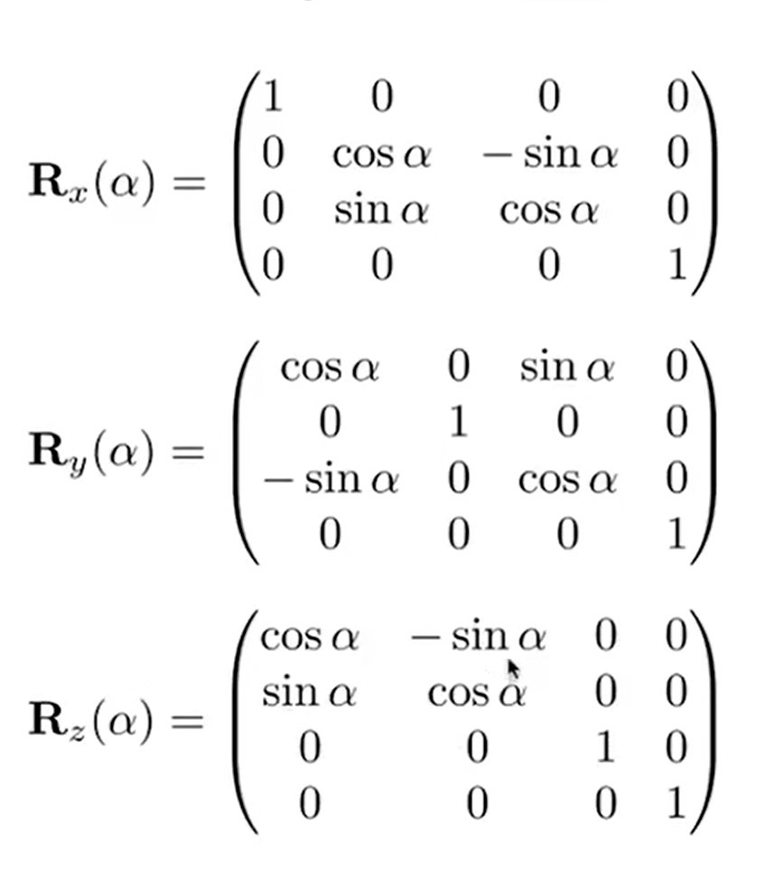

这是**右手坐标系**（实质与二维坐标系相同）中的旋转：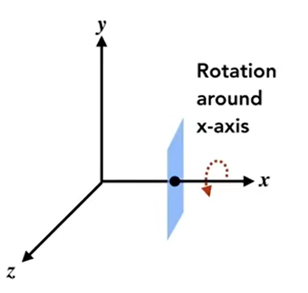

**根据前面：旋转矩阵的行向量依次决定变换后x' y' z'的取值**，那么绕着哪个轴旋转，对应哪个坐标就不变。

这意味着，绕着哪个轴旋转，变换矩阵里面哪一行、哪一列的元素除与x/y/z相乘时保留的系数1，其余都为0：

**注意Ry**：

- 回忆在二维平面中的旋转变换，**旋转的方向是绕着生成z轴的叉乘方向，即逆时针旋转**，它的变换矩阵从左上到右下是cos -sin cos sin；这个z轴是怎么来的？**就是x叉乘y得到的z（正方向向上）**。根据x y z的摆放顺序，二维中是xy->z，旋转方向就是逆时针。

- 那么同样地放到三维中，抄到左上角的线性变换分块矩阵中：
  - 对于x，把第1行和1列换成0，（1，1）的元素换成1，抄变换矩阵：由于y叉乘z得到x，则说明旋转方向（y在z前面）还是逆时针，所以变换矩阵抄过来即可。
  - 对于y，把第2行和2列换成0，（2,2）的元素换成1，抄变换矩阵：由于这里是z叉乘x得到y，它在xyz的排序中是反过来的，所以变成了顺时针旋转。于是需要将变换矩阵求逆（正交，结果等价于转置）一下再填进去。
  - 对于z和x一个道理，x叉乘y得到z，所以是逆时针，不用转置填进去就行了。

**->tip：**结合后面所得的“旋转就是在新的基下再表示一次，而旋转矩阵的一个极大无关组就是新的基”，绕某个轴旋转也可以看做将原始基（1,0,0,0）、（0,1,0,0）、（0,0,1,0）变换为一组新的基，此时被绕的那个轴是不变的，所以是1；结合前面那个平面上的旋转变换（即绕着z轴旋转），旋转后x上的(1,0)变成了(cosθ,sinθ)、y上的变成了(-sinθ,cosθ)，正好与(1,0)组成一组新的基向量。所以这个绕某轴旋转矩阵就是以他们为极大无关组的向量。

——绕任意轴的旋转。

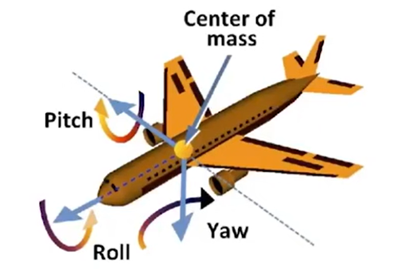

绕任意轴的旋转都可以分解为绕三个轴的旋转。以这么一架飞行的飞机为例，绕着侧面轴旋转称为pitch，绕着前进方向上的轴旋转叫做roll，绕着下方轴的旋转叫做yaw。由于旋转的可逆性，它们的变换矩阵相乘前后不改变秩所以一定可以分解。

**罗德里德斯旋转公式（Rodrigues' Rotation Formula）**

将向量v绕着**单位**向量$\bold u=\pmatrix{u_x\\u_y\\u_z}$旋转θ角度，则变换矩阵为：

$\bold R(\bold n, \theta)=\cos(\theta)\bold I+(1-\cos(\theta))\bold u\bold u^T+\sin(\theta)\pmatrix{0&-u_z&u_y\\u_z&0&-u_x\\-u_y&u_x&0}$

- 这里的$\bold n$是一个起点为原点的单位向量。也就是这个公式默认解决的是绕着一个过原点向量的旋转；这里的I是向量v的方向单位向量。

- 那么如果要绕着任意轴旋转呢？和上一节的分解一个道理，先移动坐标系把n的起点移动到原点，再旋转，再恢复。

- 推导：

  - 将v分解为垂直n和平行n的两部分。分别记作$v_v、v_p.$则$v_v=|n||v|\cos\gamma\cdot n=(n\cdot v)n, v_p=v-v_v.$其中前者的计算是将v投影到n上再附加上n的方向。

  - 于是v的旋转就可以分解为平行和垂直量的分别旋转后相加。平行向量旋转后不变（向量不含具体位置信息，只含相关性）；垂直向量在垂直于n的平面内旋转α角度。垂直分量的旋转以及合成如下：

    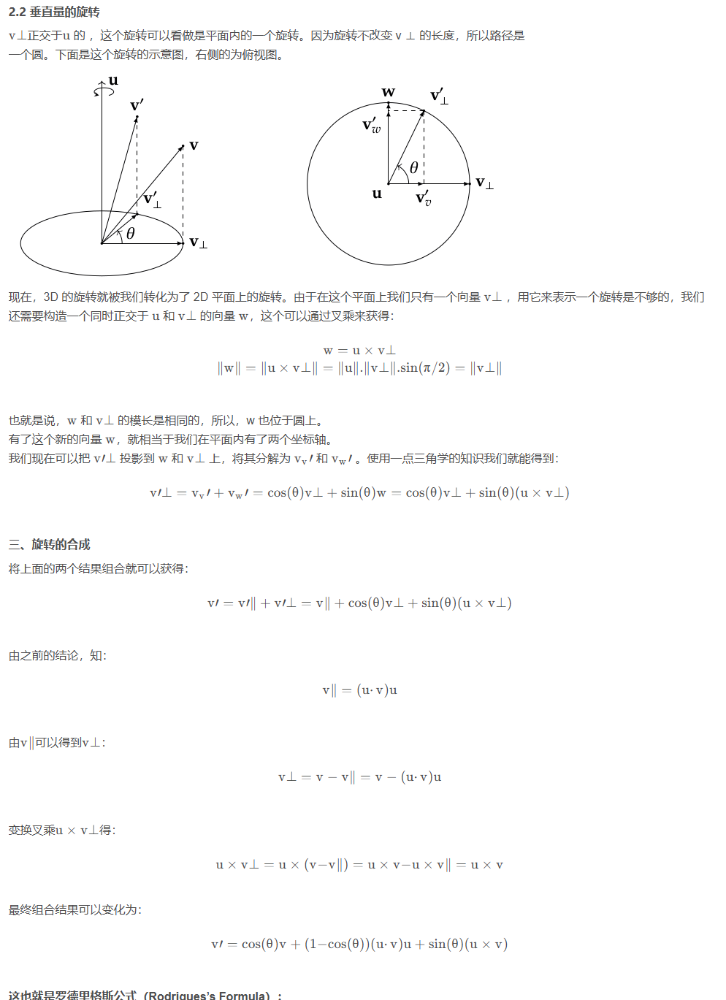

​	这里的$v'_\perp=v_v'+v_w'=\cos\theta v_\perp+\sin\theta w$，是看上面的图中，θ夹角处于的三角形中的斜边与$v_v'和v_w'$等长。所以cos、sin描述的边边比例关系可以直接套到上面。

​	最后得到的公式中，可以代入之前引入的对偶矩阵，由$k\times v=[k]_\times v、(k\cdot v)v = (kk^T)v$，代入后把v提出来，就得到剩下的系数，即**变换矩阵**的表达式。

#### 三、视图和投影变换

##### 0.做什么？

想象要为一群人拍照。

- 将他们组织起来摆好姿势——模型变换 model

- 找到一个好的拍摄角度——相机变换 view 

- 拍摄——投影变换 projection

  以上变换称作M-V-P变换。

##### 1.view / camera transformation 相机/视图变换

这个变换也叫做ModelView Transformation.

###### 1.定义相机

给定一个三维空间中的相机，它可以由以下内容定义：

- 位置position。由一个原点出发的向量$\vec e$表示。
- 看向的方向look-at/gaze direction。由一个从相机出发的向量$\vec g$表示。
- 向上方向up direction。**实际上就是相机头顶的朝向**，由一个从相机出发的向量$\vec t$表示。**默认垂直于$\vec g$**.

既然所有内容都从相机来，那么直接将相机放到原点，则出现以下设置：

**右手系中，**目标是将相机放置转换为在原点、始终看向-z方向、头顶向+y方向。

既然要变换位置，就需要找一个矩阵将相机的三个向量变换到与处于原点时符合，记作$M_{view}$

->补充：OpenGLAPI中使用左手系。

###### 2.具体变换移动过程

变换步骤应该是：

- 首先将$\vec e$移动到原点（将其变为零向量）
- 然后将$\vec g$旋转到-Z方向。
- 然后将$\vec t$旋转到+Y方向。
- 然后将$\vec g\times \vec t$旋转到+X方向。

直接求解这个矩阵困难，分解为：

- 先平移到原点再旋转，于是$M_{view}=R_{view}T_{view}$，其中$T_{view}=\pmatrix{1&0&0&-e_x\\0&1&0&-e_y\\0&0&1&-e_z\\0&0&0&1}$；

- 直接写R不好写，反向思考：看做将坐标轴旋分别旋转到相机的向量上。

  - 由于旋转矩阵一定是正交矩阵。

  $$
  设任意两向量\vec u和\vec v。经过相同矩阵作用下的旋转后，它们应该保持内积不变（旋转只改变方向，不改变大小和夹角），故\\
  	(R\vec u)\cdot(R\vec v)=\vec u\cdot \vec v，以矩阵乘法写法即(R\vec u)^T(R\vec v)=\vec u^T \vec v\\
  	拆开就是 \vec u^TR^TR\vec v=\vec u^T\vec v，移过去\vec u^T(R^TR-I)\vec v=0.\\
  	由矩阵乘法和秩的关系，r(\vec v)+r(\vec u^T(R^TR-I))\le v的列数=1，而r(\vec v)=1.所以\\
  	r(\vec u^T(R^TR-I))=0,这只能是r(R^TR-I)=0,则R^TR-I=0，R^TR=I，即R是正交矩阵。
  $$

  ​	所以旋转矩阵的列向量一定是一组n维空间的基向量。这也就是说，旋转矩阵乘在某个向量左边后计算的结果，**其实质等价于在旋转矩阵所标志的新坐标系下表示出这个向量；旋转矩阵的一个极大无关组就是新的基。**

  - 所以，以相机的三个向量$\vec g、\vec t、\vec g\times \vec t$就是相机坐标系的一组基，将其依次写到旋转矩阵中，就可以对任意同维度向量进行新坐标系的表示，或者说叫旋转到相机坐标系上。自然，将原来的坐标轴上的方向向量（1,0,0,0)、(0,1,0,0)、(0,0,0,1)这样表示也完全可以。
  - 换句话说，$p=(p_x,p_y,p_z)$是坐标系的一个点的话，其在基$R=[u,v,w]$下的表示就是$[u,v,w]\pmatrix{p_x\\p_y\\p_z}$（看做从原点出发的一个向量）。这就是一种旋转，或者说新的表示。
  - 当然，这里说的是反向思考的结果，即想求的旋转矩阵的逆矩阵。

- 所以待求旋转矩阵的逆矩阵就是：$R=[\bold t\times \bold g,\bold t,-\bold g,\bold {v_4}],v_4=(0,0,0,1)^T$.由于正交，其逆矩阵，即所求矩阵，转置即可得到。

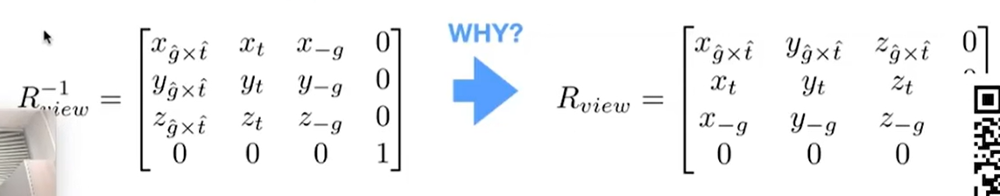

$R_{view}^{-1}$就是将原来三个坐标轴的方向向量旋转到以$\bold t、-\bold g、\bold t\times \bold g$为基的空间中。

所以最后的结果就是：$M_{view}=R_{view}T_{view}=[\bold t\times \bold g,\bold t,-\bold g,\bold {v_4}]^T\pmatrix{1&0&0&-e_x\\0&1&0&-e_y\\0&0&1&-e_z\\0&0&0&1}$，

##### 2.projection transformation 投影变换

区别：

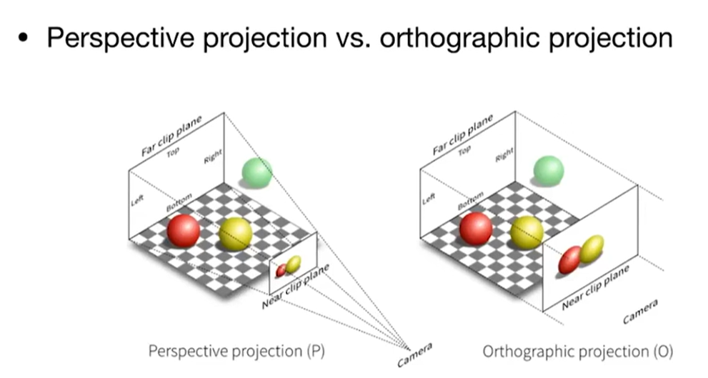

正交投影中平行线投影后还是平行的；透视投影中不会。

###### 1.orthographic projection 正交投影

最简单的想法：将相机按照前一节的方法摆放好，那么只需要舍弃图形的z坐标，就是一张二维的投影；然后归一化到[-1,1]上即可。

对于一个二维平面的正交投影：先定义相机的近处拍摄面，再将远处的图像投射到这个面上。

通用做法：

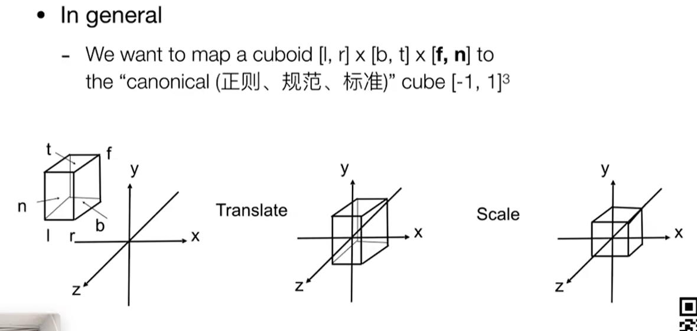

在空间中定义一个立方体，方法是定义他的上下（在y坐标轴上两个面中心点的y值）、左右、远近。

- 注意，上下、左右都是值越大，越靠上、越靠右；但是远近是值越大越近，这是比较反直觉的，所以OpenGL采用了左手系。

然后将其中心变换到坐标原点，再缩放到[-1,1]^3^空间中。

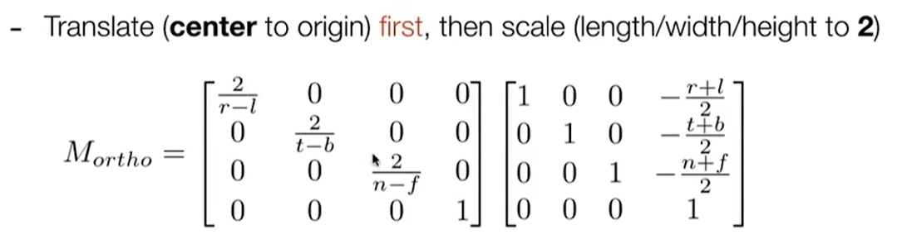

- 右侧矩阵即平移矩阵，第4列写的三个数字即计算出的立方体正中心（三个方向上的中心），将其作为一个向量，然后取负号表示反向移动。
- 左侧矩阵即缩放矩阵，缩放规格即：缩放后的大小（从-1到1是2）与缩放前的大小，缩放前的大小是对应坐标轴上相减（正减负）。

###### 2.perspective projection 透视投影

在透视投影中物体近大远小、平行线会在远处相交。

回顾之前的坐标表示：$(kx,ky,kz,k(k!=0))$表示的即三维点$(x,y,z)$。同理，坐标$(zx,zy,z^2,z)$也表示那个点。

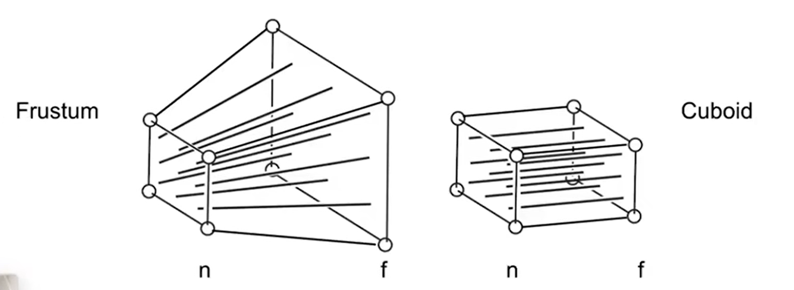

frustum：视锥

透视投影的步骤可以分解为三步：

- 和正交投影一样，在z方向上定义一个近处的面和远处的面，但这时近处面是远处面的一个更小缩放。
- “挤压”被透视平面，使得远平面上的点全部被挤压后形成一个新的平面，这个新的平面上的点与近处平面上的点一一都只有z不同。
- 做正交投影，将远处的面投射到近处的面上。

①那么如何挤压？相似三角形即可。

定义近平面的z值为n，**这是一个已知值，或者说超参数。**而**远平面的z是未知值，或者说是变量**。

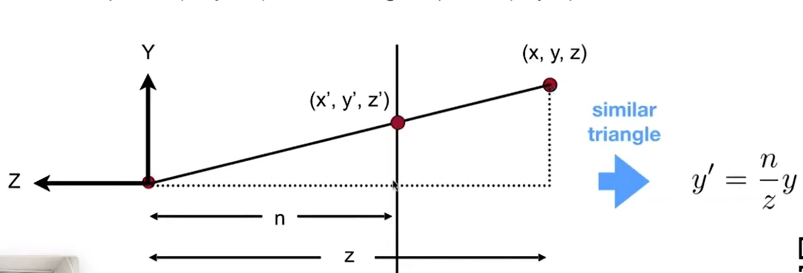

上图是一个侧视图，x轴正向是从纸面向外指向你的。那么自然就有$y'=\frac{n}{z}y$。也就是，只需要知道近和远平面的z坐标、待投影点的y坐标，即可知道投影后的y坐标。所以类似地就有：
$$
y'=\frac{n}{z}y、x'=\frac{n}{z}x.
$$
此时还只涉及寻找挤压矩阵，被变换的点在变换前后都仍在远处的平面上，z坐标未发生变化。得到的点变换为：$\pmatrix{x,y,?,1}\to\pmatrix{nx/z,ny/z,?,1}，同乘z即\pmatrix{nx,ny,?,z}$。这里的问号是指变换前后z不变，而远平面预先定义，每一个不同的面都有不同的z，无法直接得到；除此之外有个特例：**远平面的中心点在变换前后的xyz都不变。**

挤压矩阵定义为$M_{persp\to ortho}$，如果将其左乘远平面上的某个点，就能将其变化为挤压后的远平面上的点。

所以根据上面的变化，可以得到挤压矩阵为：

$M_{persp\to ortho}=\pmatrix{n&0&0&0\\0&n&0&0\\?&?&?&?\\0&0&1&0}$

该矩阵应该具有两个特点：

- 对远处平面上的点做变换，得到的点的z坐标不变。这个很显然。
- 对近处平面上的点做变换，得到的还是那个点。这个可以看做远处平面上变换的一个特例，如果远处平面本身就是一个和近处平面一样的平面（没有缩放），那么变换后还是一样的。

对应地就是：
$$
对\pmatrix{x,y,n,1}变换后得到\pmatrix{x,y,n,1}或者说\pmatrix{nx,ny,n^2,n}; 对\pmatrix{x,y,z,1}变换后得到\pmatrix{nx,ny,?,1}。\\
这样，矩阵的第三行必然是\pmatrix{0&0&A&B}，也有\pmatrix{0&0&A&B}\pmatrix{x\\y\\n\\1}=n^2.\\
所以An+B=n^2；对于远平面的中心点，变换前后xyz不变，即\pmatrix{x_p,y_p,f,1}\to\pmatrix{fx_p,fy_p,f^2,f}，即Af+B=f^2.\\
这样解得A=n+f,B=-nf。f即定义的远平面的z值。
$$

**这样，透视投影变换的第一个挤压矩阵与被透视的平面有关。**其结果应该是：
$$
M_{persp\to ortho}=\pmatrix{n&0&0&0\\0&n&0&0\\0&0&n+f&-nf\\0&0&1&0}
$$

#### 四、光栅化Rasterization

光栅化本意是将物体转化为打印行形式，即物体经过投影，都被放置到了标准的[-1,1]空间中，下一步就是画在屏幕上。

##### 1.三角形的光栅化

①如何定义frustum？即如何定义一个近处平面（远处的是待被投影的，是已知的）

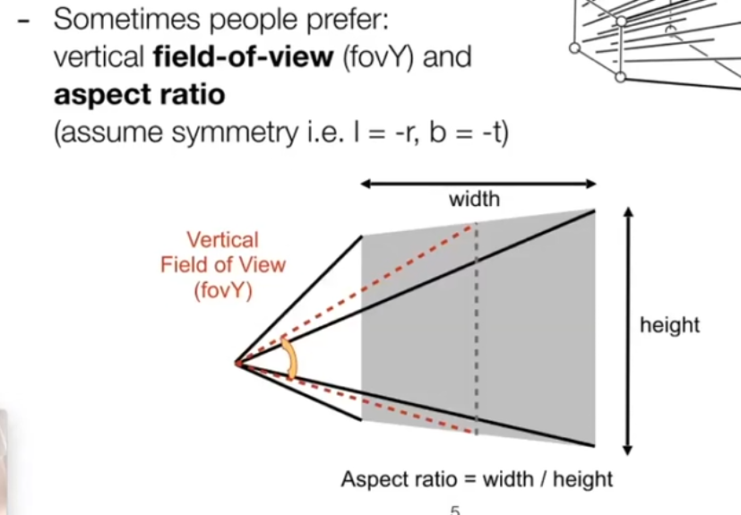

近处平面如何定义？

- 定义**长和宽**，其比值称为**纵横比Aspect retio**。例如说什么屏幕是16:9的。
- 定义一个视场宽度角field-of-view，由于它主要是y方向上的宽度，也记作**fovY**。注意它是一个角度。

那么如何转化已知量来计算这些值？

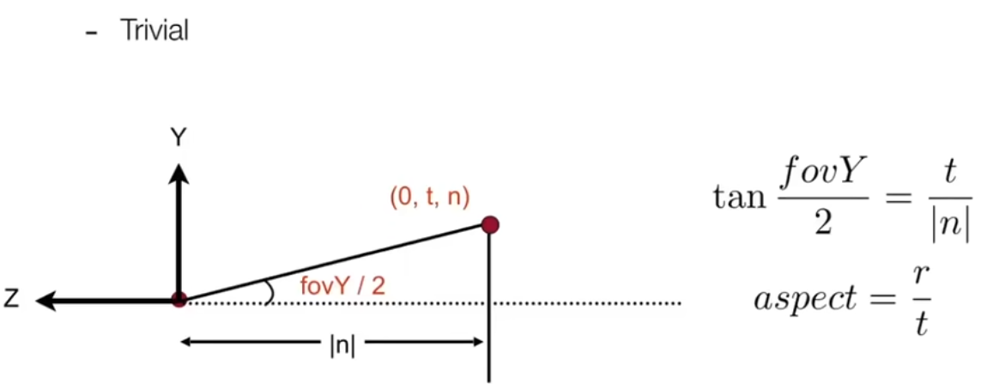

- r即宽度的一半。

也就是，只需要定义近平面的宽、高、fovY即可定义这个平面。

###### ②光栅、屏幕、像素

- 德语Raster就是指screen 屏幕。rasterize == drawing onto the screen.

- 屏幕是一个典型的光栅成像设备，它定义为**一个像素数组**。
  - 这个像素数组的大小称为分辨率。
- 像素：picture element 简写为pixel.
  - 本课程定义其为一个具有固定颜色的小方块。
  - 颜色定义为（red, green, blue)即RGB。

###### ③定义屏幕空间

​	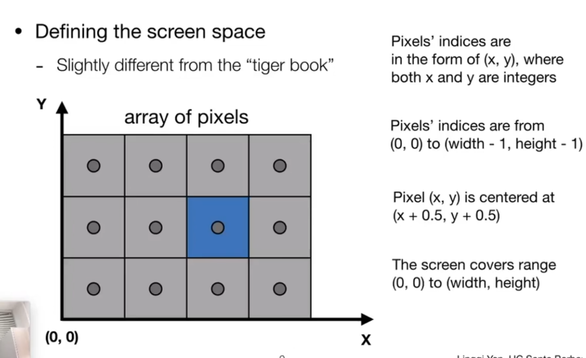

- 每一个像素是一个小方块，它的坐标与其左下的点坐标相同。
- 每一个像素还具有一个中心点，这个点的位置是(x+0.5, y+0.5)
- 这样，像素的坐标范围即（0,0）到（width-1, height-1)；屏幕的范围即（0,0）到（width, height)。

###### ④转换投影后的图像到这个范围内，视口变换

由于摄像机的朝向是确定向-z的，所以z轴坐标对现在定义的像素没有影响，后续会用到。

那么即将投影、归一化后在$[-1,1]^2$范围中的点映射到$[0,width]\times[0,height]$.

这个变化可以分解为：先将$[-1,1]^2$平移到右上方$[0,2]\times[0,2]$的范围，再将其通过缩放，变为$[0,width]\times[-0,height]$范围内的一个点；注意要用线性变换左乘平移变换：

$M_{viewport}=\pmatrix{\frac{width}{2}&0&0&\frac{width}{2}\\0&\frac{height}{2}&0&\frac{height}{2}\\0&0&1&0\\0&0&0&1}$

以上变换称为**视口变换。**

注意第四列的内容，它**不能是**1,1,0,1.因为齐次坐标变换矩阵**一定是表示先线性变换、再平移变换**。

###### ⑤一些科普

- 阴极射线管：最早的光栅显示设备。
- 光栅扫描技术：从屏幕的左上角到右下角依次绘制足够密集的直线用于控制显示的颜色。后来衍生出了隔行扫描技术，在每一个时刻只绘制奇数或偶数行的线来降低绘制量。
- 帧缓冲：用于光栅显示的缓存
- 平板显示器：现代的光栅显示设备。
- LCD：Liquid Crystal Display液晶显示器，其原理是通过液晶分子旋转光的偏转方向，使得通过的合成光无法透过或部分透过以控制像素的显示。LCD本身是不发光的，是一种背光源。
- 
